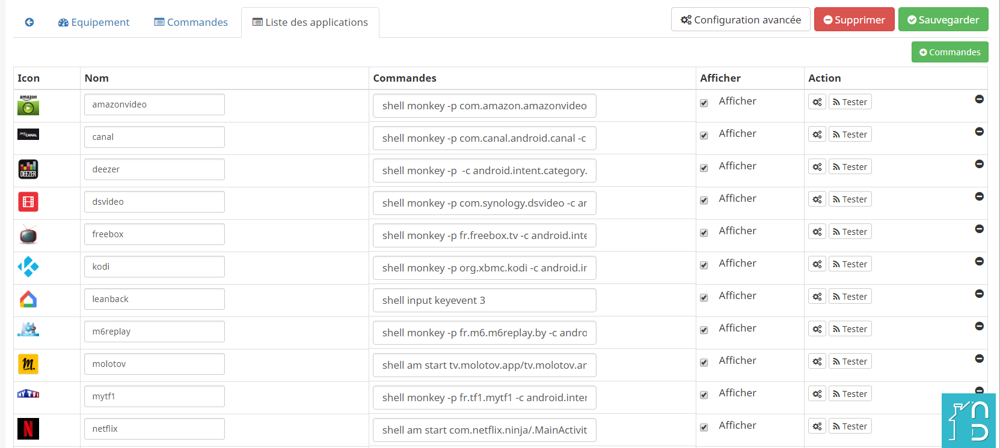
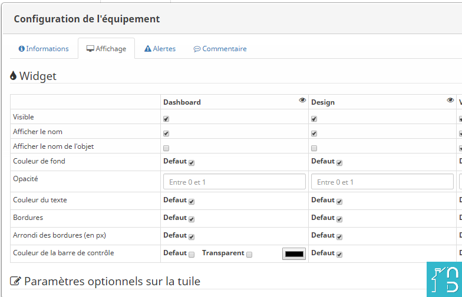

# Description

Plugin permettant de piloter les terminaux android (TV, Shield, freebox mini 4k, Smartphone, etc..)

### Fonctions disponibles
Infos :
* nom de l'appareil
* état (allumé/Eteint) (buggé pour l'instant)
* application en cours
* résolution
* version Android
* espace disque disponible
* status de lecture (play, pause, arret)
* nom du titre encours de lecture

Actions :
* accueil, retour
* allumage, extinction
* volume+, volume-, slider volume
* haut, bas, gauche, droite
* clic, entrer
* démarrage, lecture, pause, arrêt
* précédent, suivant
* lancement des applications : Youtube, FranceTV, Plex, Spotify, VLC, TF1, Google, Facebook, Molotov, Netflix, etc.

Scénarios possible :
* Allumer la box -> lancer Molotov -> lecture avec commande vocale Google Home/ifttt (ex: "ok google, met la télé en route").
* Commander l'allumage de l'ampli (Yamaha dans mon cas) lorsque la box est allumée (car parfois le HDMI CEC).
* Si Netflix lancé -> lumière salon à 50%

### Equipements testés
Actuellement le plugin a été vérifié sur les matériels suivants:
* Nvidia Shield (pas de configurations supplémentaires a effectuer).
* Oneplus 5t (pas de configurations supplémentaires a effectuer).
* Freebox mini 4k (pas de configurations supplémentaires a effectuer).
* Xiaomi mibox TV (Le port 5555 servant a ADB n'est pas ouvert par défaut), il faut connecter la box en USB et lancer les commandes suivantes:
    - adb connect
    - adb tcpip 5555
    - adb conncect 192.168.x.x:5555
    - debrancher le cable

Vous pouvez également changer la couleur du bandeau du bas ou le rendre transparent.

# Market

Retrouvez le sur le [Market](https://www.jeedom.com/market/index.php?v=d&p=market&type=plugin&&name=Plugin) Jeedom

# Prévisualisation

Lien vers le [Forum](https://www.jeedom.com/forum/viewtopic.php?t=34154)
