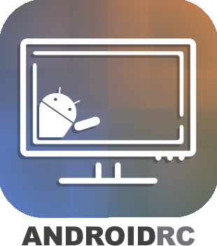
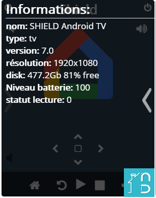
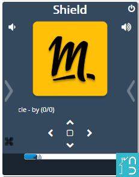
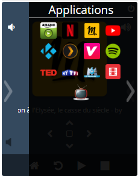

# Description

Plugin permettant de piloter les terminaux android (TV, Shield, freebox mini 4k, etc..)

### Fonctions disponibles
Infos :
* nom de l'appareil
* Etat (allumé/Eteint) (buggé pour l'instant)
* App encours
* résolution
* Version Android
* Espace disque disponible

Actions :
* home, back
* power on, power off
* volume+, volume-
* up, down, left, right
* click, enter
* start, play, pause, stop
* previous, next
* lancement des appli: youtube, francetv, plex, spotify, vlc, tf1, google, facebook, molotov, netflix, etc...

Scénarios possible :
* Allumer la box -> lancer molotov -> play avec commande vocale google home/ifttt (ex: "ok google, met la télé en route").
* Commander l'allumage de l'ampli (Yamaha dans mon cas) lorsque la box est allumé (car parfois le HDMI CEC).
* Si netflix lancé -> lumière salon a 50%

### Parametrage avancé
Vous pouvez afficher ou non la liste des applications dans le bandeau du bas (limité a 6) en cochant/décochant l'option afficher sur chanque commande (voir capture ci-dessous)

Vous pouvez également changer la couleur du bandeau du bas ou le rendre transparent.

# Market

Retrouvez le sur le [Market](https://www.jeedom.com/market/index.php?v=d&p=market&type=plugin&&name=Plugin) Jeedom

~~Changer **_Plugin_** par le nom du plugin dans l'adresse https du lien~~

# Prévisualisation

# Forum

Lien vers le [Forum](https://www.jeedom.com/forum/viewtopic.php?t=xxxx)

~~Remplacer `t=xxxx` par le bon numéro de forum~~
